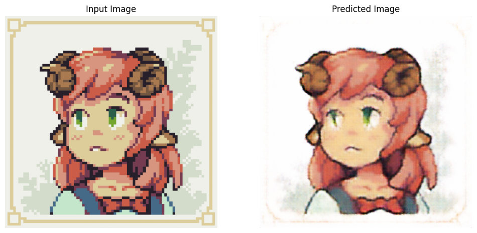
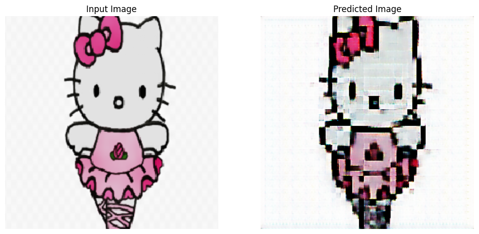

## Models

### CycleGAN

Pixel Art to Drawing [Source](https://www.pixilart.com/art/pink-sheep-sr23793e6629eaws3)



Drawing to Pixel Art



## Setup

- Download dataset [here](https://drive.usercontent.google.com/download?id=1YAjcz6lScm-Gd2C5gj3iwZOhG5092fRo&export=download)
- Unzip and put folder in `/dataset/draw2pix`
- Download latest checkpoint of desired model [here](https://drive.google.com/drive/u/0/folders/1OABzz2pnsTO9XJNzkdbTDnTZ2tDzywAc)
- Unzip and put folder in `/notebooks/checkpoints/draw2pix`
- Run notebook in `/notebooks/`

## Folder Structure

```
├── CustomImages /* Your images */
│   ├── Draw
│   └── Pix
├── dataset
│   ├── draw2pix /* 1 subfolder per class in dataset */
│   │   ├── Multi-cell pixel art
│   │   └── Non-pixel art
├── notebooks /* Write new notebooks here */
│   └── checkpoints
│       └── draw2pix /* Checkpoints must be saved here */
│           └── cycleGanPix2Pix /* Model Name */
│               └── train
├── results /* Saved results graphs/images */
```

## Description

The training requires both non-pixel art and pixel art images.

For non-pixel art, dataset = 4235 non-pixel art images, where 790 images are from the CartoonSet [Royer et al. 2020], 277 images are from the Abstract Scenedataset (Zitnick and Parikh 2013), and the rest are from the Internet. All images are scaled to the resolution of 512×512.

For pixel art, Multi-cell dataset of pixel arts with different cell sizes of a fixed resolution (256\*256): 7000 images, with 1000 images for each cell size (cell size = scaling factor of 2x, 3x, 4x, 5x, 6x, 7x, 8x).


## Acknowlegdements

- [pytorch-CycleGAN-and-pix2pix](https://github.com/junyanz/pytorch-CycleGAN-and-pix2pix)
- [Aliasing-Aware and Cell-Controllable Pixelization](https://github.com/WuZongWei6/Pixelization) - [Data Download Link](https://drive.usercontent.google.com/download?id=1YAjcz6lScm-Gd2C5gj3iwZOhG5092fRo&export=download)
- [Custom Images from pixelart.com](https://www.pixilart.com/)
